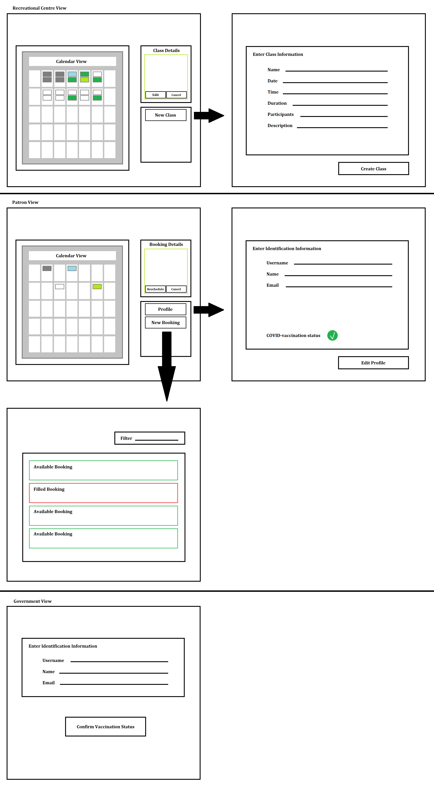

# COVID-Booking: Booking Application with COVID-Vaccination Screening

## Context

### The Problem
In a post-pandemic world, people are more cautious than ever. Returning to a life where we enjoy normal recreational
classes in a group setting can be intimidating, especially when one doesn't know whether the rest of the class has been
vaccinated.

### Who is it for?
Specifically, this version of the COVID-Booking application has 2 users: **recreational centres** and their **patrons**.
Beyond this, the application can be scaled to other use cases where companies require clients to book appointments
(e.g. health offices, events, etc.). This version of the COVID-Booking application will focus on screening patrons for
COVID-vaccination status, but this idea can be scaled to screen patrons for other prerequisites (e.g. veterans,
hospital-workers, teachers, etc.).

### What will it do?
**The COVID-Booking application is a booking application with COVID-vaccination screening capabilities**. It will allow
patrons to easily book group classes at a recreation centre, while feeling assured that they are booking a recreational
class where other members of the class are also vaccinated.

### What type of data will it store?
The COVID-Booking application will store information about the patrons (e.g. name, birthday, email, COVID-vaccination
status, etc.), the recreation centres (e.g. name, location, ultilities, etc.), and data about classes offered (e.g.
times, types, occupancy, etc.). If time permits, it may also store correspondence between the recreation centre and
patrons.

### What will users be able to do with this data?
Recreation centres will be able to use this data to see if their patrons meet any prerequisites (i.e. COVID-vaccinated)
for booking. Recreation centres will also be able to use this information to contact thier patrons. Patrongs will be
able to view classes that recreation centres are offering and will be able to view the type (description) and time of
their bookings.

### What is some additional functionality you can add/remove based on time constraints?
If time permits, a login feature will be added. As well, a third user (i.e. the government) will allow the COVID-Booking
application to be used as a COVID-Passport application as well. A rating system could also be implemented.

## Feature List

### Minimal Requirements:

1. Recreation centre booking functions:
    - Create a class
        - Name the class
        - Set duration of class
        - Set time and date of class
        - Set minimum and maximum number of participants per class
        - Set price of class
        - Set location (room) of class
        - Set intructor
        - Set items to bring/required equipment
        - Add description
    - Edit a class
    - Delete a class
2. Patron functions:
    - View classes
        - See class info
        - See availability
    - Book a class
        - See booking information
    - View all booking(s)
    - Cancel a bookng
3. Screen patrons for COVID-vaccination status before allowing them to book a class
    - Create a patron's information page
        - Set a COVID-vaccination status
    - Create booking slots that check the patron's status

### Standard Requirements:

1. Create a calendar view
    - Recreation center's schedule
    - Patron's bookings
2. Add color to show availability of classes
    - Green = available
    - Red = fully booked
3. Highlight today's date
4. Ordered list of most popular to least popular classes (based on bookings)
5. Allow patrons to see their past classes
6. Filter and display classes by category

### Stretch Requirements:

1. Allow patrons to rate their past classes
2. Create a login with passwords and usernames
    - Log in
    - Log out
    - Forgot password
    - Create account
    - Edit account
    - Delete account
3. Create a COVID-Passport application
    - Create a third user (government)

## Mock-ups

